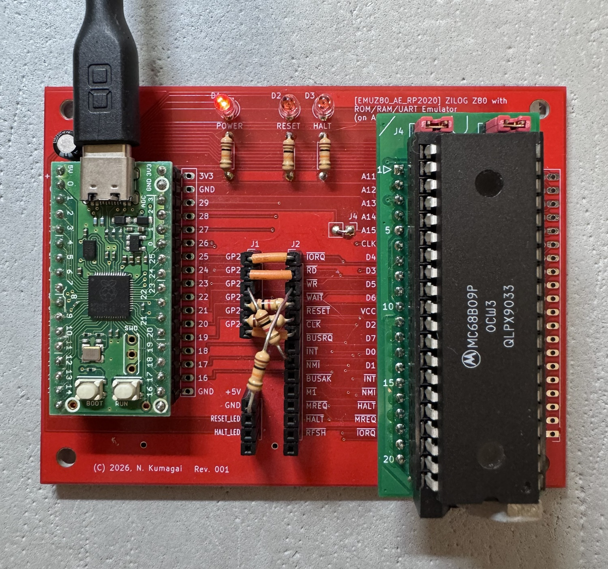
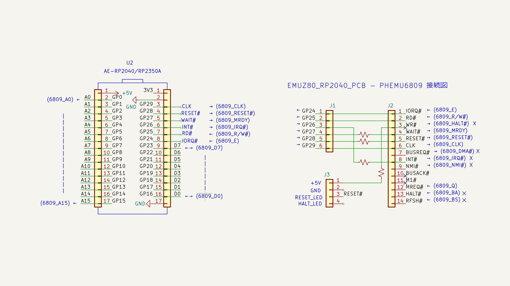
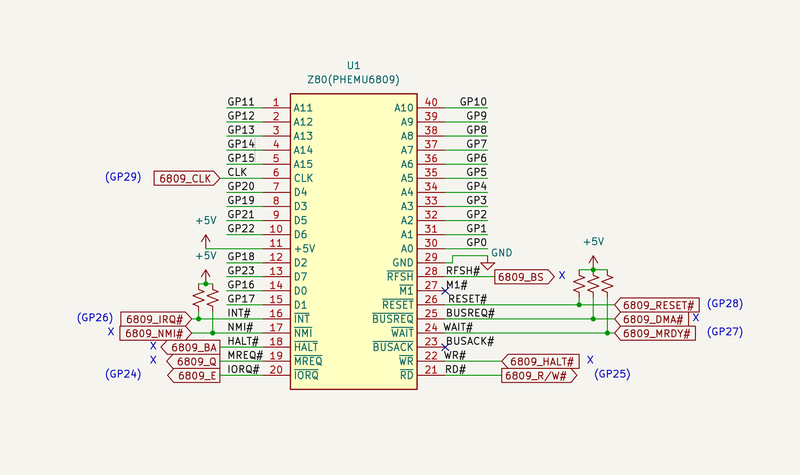
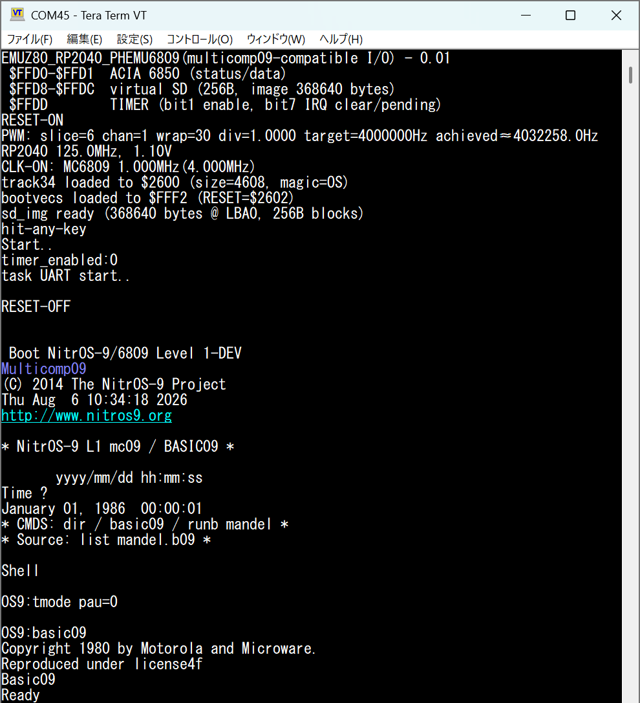
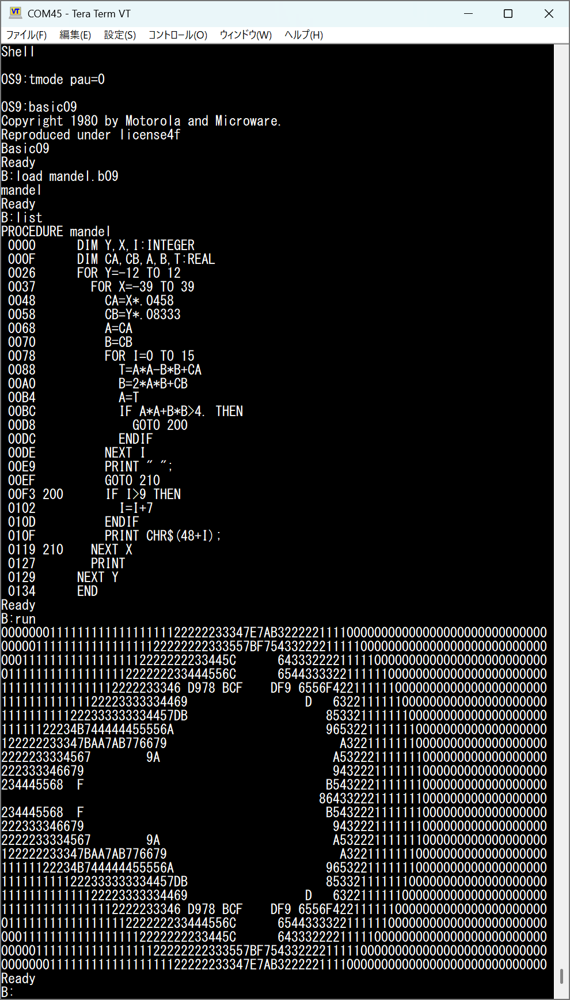

# EMUZ80_RP2040_PCB_PHEMU6809_Firmware



[@tendai22plus さんの **EMUZ80_RP2040_PCB**](https://github.com/tendai22/EMUZ80_RP2040_PCB) と
[@comoneko さん作の **PHEMU6809**](https://github.com/comoneko-nyaa/phemu6809conversionPCB) 変換基板を使って、Z80 DIP40 信号を MC6809P 互換に組み替えし、
RP2040 上で MC6809 バスをエミュレートするファームウェアです。

作者: @DragonBallEZ

## 概要

秋月電子通商 AE-RP2040 上で動作する、EMUZ80_RP2040_PCB 用ファームウェアです。
RP2040 が 64KB RAM と MC6850 互換 ACIA (0x8018/0x8019) をエミュレートし、
メイン CPU 側には BASIC9 ROM を提供します。

- RP2040 デュアルコアによる高速バスエミュレーション
- 64KB のエミュレーション RAM をアドレス空間 $0000-$FFFF にマップ
- MC6850 互換 ACIA を I/O アドレス $8018/$8019 でエミュレート
- USB CDC (`stdio_usb`) でシリアル I/O をブリッジ
- BASICは SBC6809 ROMデータそのまま使用
- BASIC9 ROM を $C000 からロード
- システムクロック 288MHz で動作（`TARGET_SYS_CLK_KHZ` にて調整可能）
- PWM で MC6809 クロック出力を生成（デフォルト 4MHz）

## 対象ハードウェア

- @tendai22plus さん作 EMUZ80_RP2040_PCB
- @comoneko さん作 PHEMU6809 変換基板  
→ [オレンジピコショップ](https://store.shopping.yahoo.co.jp/orangepicoshop/pico-a-056.html)
- MOTOROLA MC6809P (DIP40)
- 秋月電子通商 AE-RP2040

## ピン割り当て

| GPIO  | 信号   | 方向  | 説明                                      |
|-------|--------|-------|-------------------------------------------|
| 0-15  | A0-A15 | IN    | アドレスバス                               |
| 16-23 | D0-D7  | IN/OUT| データバス                                 |
| 24    | E      | IN    | E クロック                                |
| 25    | R/W#   | IN    | R/W#                                      |
| 26    | Q      | IN    | Q クロック                                    |
| 27    | MRDY   | OUT   | READY（High=Ready, Low=Wait）          |
| 28    | RESET  | OUT   | RESET（Low=Reset）                         |
| 29    | CLK    | OUT   | クロック出力（PWM）                 |


## 参考回路図





## ビルド方法

### 必要環境
- Raspberry Pi Pico SDK
- CMake + Ninja または Make
- ARM GCC ツールチェイン

### ビルド手順 (例: Windows + VS Code + Pico Extension)

```powershell
mkdir build
cd build
cmake ..
ninja
```

生成される主な成果物:
- `EMUZ80_RP2040_PCB_PHEMU6809_Firmware.uf2`
- `.hex`, `.bin`, `.elf` など

EEPROM/UF2 書き込み方法: BOOTSEL を押しながら USB 接続し、生成された UF2 をドロップして書き込み。

## 使い方

1. ファームウェアを書き込む
2. USB シリアルでターミナル接続（例: Tera Term, PuTTY, minicom）
3. ターミナル上で任意のキーを押す
4. `basic9` ROM がロードされてエミュレーションを開始

**終了方法**: `Ctrl + \` (0x1C) を送信

## 実行例




## 設定変更（上級者向け）

RP2040 システムクロック及び MC6809P クロック周波数は以下の定義をソース先頭で変更して再ビルドします。

`EMUZ80_RP2040_PCB_PHEMU6809_Firmware.c`:
```c
#define TARGET_SYS_CLK_KHZ 125000

   :

#define MC6809_CLK_HZ 4000000       // 4MHzHz
```

## ファイル構成

- `EMUZ80_RP2040_PCB_PHEMU6809_Firmware.c` - メインファイル
- `basic9.c` / `basic9.h` - BASIC9 ROM イメージ
- `CMakeLists.txt` - Pico SDK 用ビルド設定

## 免責およびライセンス

- 本プロジェクトは MIT License です。
- 詳細は [LICENSE](LICENSE) を参照してください。
- 各組み込みライブラリや関連プロジェクトのライセンスは個別に確認してください。

## 謝辞

- @tendai22plus さん — EMUZ80_RP2040_PCB の作者
- @comoneko さん — PHEMU6809 互換ハードウェアのアイデアと設計
- 電脳伝説さん(@vintagechips) — EMUZ80 / SBC6809 の作者
- @tomi9tw さん — Simple6809 を SBC6809 用に移植
- grant さん — Simple6809 の移植と互換性改善
- Raspberry Pi Foundation / Pico SDK チーム
- EMUZ80 系および 6809/68000 互換プロジェクトに貢献した皆様
